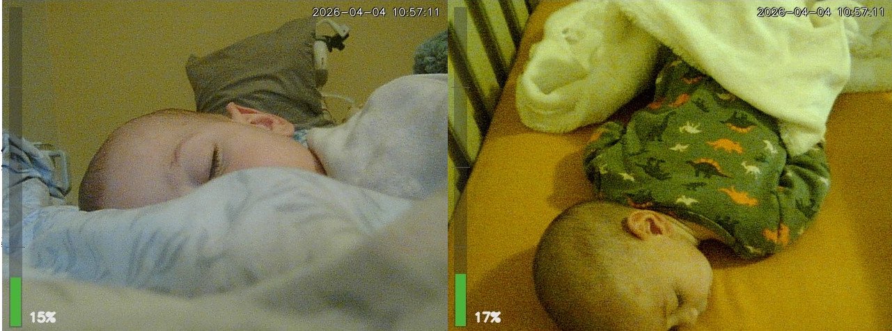
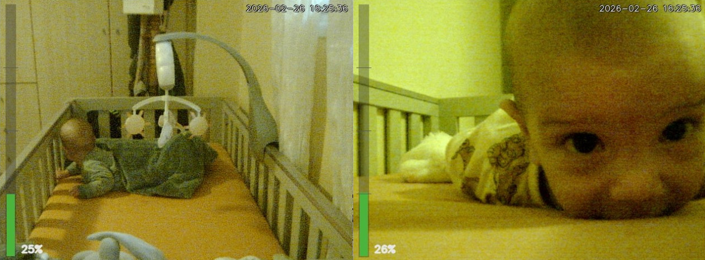

# 🍼 Baby Monitor — DIY Raspberry Pi Baby Monitor



<p align="center"><em>Ares and Hermes the two reasons for developing this application</em></p>


---

> Lightweight, browser-based baby monitor for Raspberry Pi. Streams live video from USB webcams, monitors microphone volume, and sounds an alarm when the baby wakes up — no apps, no cloud, no subscriptions.

---

## Features

| Feature | Details |
|---|---|
| 📷 Live video streaming | MJPEG stream from any `/dev/video*` device |
| 🎤 Microphone monitoring | Real-time RMS volume analysis via `sounddevice` |
| 🚨 Audio alarm | Triggers when volume exceeds a configurable threshold |
| 📊 On-screen overlay | Timestamp + live volume bar drawn on every frame |
| 🌐 Browser interface | Works on any phone, tablet, or laptop — no install |
| 🖥 Multi-camera portal | View two cameras side-by-side in one page |
| 🔊 Built-in beep fallback | WebAudio beep generated in-browser if no audio file found |
| 🔌 USB device mapping | Auto-maps cameras to their USB port suffix via `v4l2-ctl` |

---

## How It Works

```
USB Camera(s) ──► babyMonitor.py ──► MJPEG stream  ─┐
USB Microphone ──► babyMonitor.py ──► volume alarm   │
                                                      ▼
                                               portal.py
                                                      │
                                                      ▼
                                         Browser Dashboard
                                    (phone / tablet / laptop)
```

Each `babyMonitor.py` instance handles one camera and one microphone. The `portal.py` server aggregates multiple monitors into a single dashboard page.

---

## Requirements

- **Hardware:** Raspberry Pi 4 or newer, USB webcam(s), USB microphone
- **OS:** Raspberry Pi OS 64-bit (or any Linux)
- **Python:** 3.9+

Install Python dependencies:

```bash
pip install -r requirements.txt
# or manually:
pip install opencv-python numpy sounddevice
```

`v4l2-ctl` is used for USB port mapping (optional, already on Raspberry Pi OS):

```bash
sudo apt install v4l-utils
```

---

## Quick Start

### 1. Single camera

```bash
python3 babyMonitor.py /dev/video0 8080
```

Opens two ports:

| URL | Purpose |
|---|---|
| `http://<pi-ip>:8080` | Monitor UI (alarm status, volume meter) |
| `http://<pi-ip>:8081/stream.mjpg` | Raw MJPEG video stream |

### 2. Two cameras + portal

```bash
python3 babyMonitor.py /dev/video0 8090 &
python3 babyMonitor.py /dev/video1 8093 &
python3 portal.py --ip 192.168.1.12 -p 8080 -d 8090 -d 8093
```

Portal options:

```
--ip   IP address of the Raspberry Pi
-p     Portal port (default: 8080)
-d     Monitor port to include (repeat for each camera)
```

Then open `http://192.168.1.12:8080` from any browser on your network.

### 3. Autostart on boot

Edit `startup.sh` with your Pi's IP and camera ports, then:

```bash
chmod +x startup.sh
./startup.sh
```

To run at boot, add it to `/etc/rc.local` or create a `systemd` service.

---

## Alarm System

The monitor samples the microphone continuously. When volume exceeds the threshold (default **30%**), it:

- Plays `beep_short.wav` / `.mp3` / `.ogg` (first one found)
- Falls back to a generated WebAudio beep if no audio file is present
- Flashes the browser UI red/yellow
- Updates the status banner

The threshold is adjustable in the UI at runtime.

---

## Typical Hardware Setup

```
Raspberry Pi 4
├── USB Camera 1   →  crib view   →  port 8090
├── USB Camera 2   →  room view   →  port 8093
├── USB Microphone →  audio alarm
└── WiFi / Ethernet
         │
         └──► Parents connect via browser
               • Smartphone
               • Tablet
               • Laptop
               • Smart TV
```

---

## Security

This project is designed for **trusted local networks only**.

To expose it outside your home network:

- Use a **VPN** (WireGuard, Tailscale)
- Put it behind a **reverse proxy** with HTTPS (nginx, Caddy)
- Add **HTTP basic authentication**

---

## Project Structure

```
babyMonitor.py   Main monitor server (video + audio, one instance per camera)
portal.py        Multi-camera dashboard aggregator
audio.py         Audio helpers (volume reading, alarm playback)
startup.sh       Example launcher script
index.html       Portal frontend template
beep_short.*     Alarm sound files (wav / mp3 / ogg)
requirements.txt Python dependencies
```

---

## Possible Future Improvements

- Motion detection & recording
- Baby cry detection (ML-based)
- Night vision / IR camera support
- WebRTC streaming (lower latency than MJPEG)
- Mobile-optimised UI
- HTTP authentication

---

## ⚠️ Disclaimer

This software is provided **as-is**, for personal and educational use only. It is **not a certified medical or safety device** and must **not** be used as the sole means of monitoring a child.

The author accepts **no liability** for any harm, injury, or loss arising from the use, misuse, or failure of this software. Hardware failures, network outages, software bugs, and misconfiguration can all cause the monitor to stop working without warning.

**Always ensure a responsible adult is physically present or nearby when supervising an infant.**

---



---

## License

[GPL-3.0](LICENSE)
